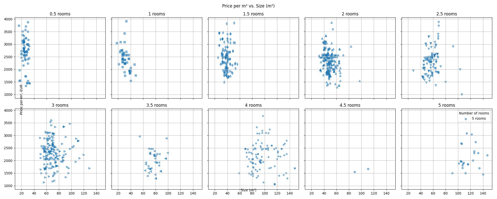
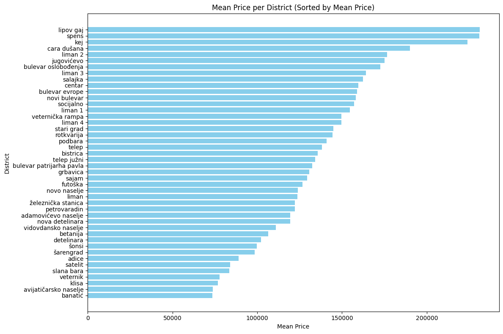

# Real Estate Price Prediction in Novi Sad

This project aims to predict real estate prices based on various features such as the number of rooms, size in square meters, and district. The dataset used in this project contains information about real estate properties including their prices, sizes, number of rooms, and district location. The project is based on data from the first quarter of 2024.

## Data Preprocessing

- The dataset is initially loaded from an Excel file (`REdata.xlsx`).
- Data exploration is performed to understand its shape, missing values, and descriptive statistics.
- Outliers are detected using z-score and removed from the dataset.
- Data visualization is used to explore relationships between variables, such as price per square meter vs. size.

## Feature Engineering

- Price per square meter is calculated and added as a new feature.
- The `Subtitle values` column is preprocessed by converting text to lowercase and removing punctuation.
- District and street information is extracted from the `Subtitle values` column and added as new features.
- Dummy variables are created for the district feature to handle categorical data.

## Model Building

- Linear Regression model is trained on the preprocessed data to predict real estate prices.
- The dataset is split into training and testing sets to evaluate the model's performance.
- Model evaluation is performed using the R-squared score.

## Price Prediction Function

- A function is created to predict the price of a real estate property based on input parameters such as district, number of rooms, and size.
- This function utilizes the trained Linear Regression model and the preprocessed dataset.

## Data discription

- The dataset contains information on 993 real estate properties.
- On average, a property has approximately 2.42 rooms and a size of 60.69 square meters.
- The average price per square meter is approximately €2,346.49, with a significant standard deviation of €535.93, indicating variability in property prices.
- Prices range from €25,850.00 to €754,490.00, with most properties falling within the range of €89,600.00 to €168,000.00.
- The dataset includes properties with sizes ranging from 16 square meters to 274 square meters and with room numbers ranging from 0.5 to 5.

|               | Price, EUR | Number of rooms | Size (m²) | Price per m², EUR |
|---------------|------------|-----------------|-----------|-------------------|
| count         | 993.000    | 993.000         | 993.000   | 993.000           |
| mean          | 139931.326 | 2.419           | 60.693    | 2346.487          |
| std           | 79476.208  | 1.101           | 30.599    | 535.930           |
| min           | 25850.000  | 0.500           | 16.000    | 972.970           |
| 25%           | 89600.000  | 1.500           | 40.000    | 1952.630          |
| 50%           | 121200.000 | 2.500           | 55.000    | 2350.730          |
| 75%           | 168000.000 | 3.000           | 72.000    | 2641.940          |
| max           | 754490.000 | 5.000           | 274.000   | 4929.580          |

## Distribution By District

- Districts with higher mean prices tend to have a wider range of property prices, as seen from the higher standard deviations.
- Some districts exhibit relatively consistent pricing, with smaller standard deviations indicating less variability in property prices.
- Districts like "Lipov Gaj" and "Spens" stand out for having high mean prices and relatively high standard deviations, suggesting a wide range of property prices within these areas.
- On the other hand, districts like "Sarengrad" and "Satelit" have lower mean prices and smaller standard deviations, indicating more consistent pricing across properties.
- Despite some districts having a lack of data, the table still represents the current view of the real estate market in Novi Sad, providing valuable insights for buyers, sellers, and real estate investors to understand pricing trends and make informed decisions.

| District               | Count | Mean Price | Min Price | Max Price | Price Std |
|------------------------|-------|------------|-----------|-----------|-----------|
| adamovićevo naselje   | 4     | 119480.00  | 95270     | 141410    | 20376.60  |
| adice                  | 73    | 88988.07   | 25850     | 141850    | 27473.21  |
| avijatičarsko naselje  | 8     | 73900.00   | 67700     | 89000     | 8949.54   |
| banatić                | 2     | 73635.00   | 65900     | 81370     | 10938.94  |
| betanija               | 3     | 106483.33  | 97850     | 123600    | 14823.66  |
| bistrica               | 12    | 135725.83  | 74150     | 199820    | 49160.76  |
| bulevar evrope         | 16    | 158877.50  | 83430     | 288400    | 64682.85  |
| bulevar oslobođenja    | 39    | 172660.00  | 46350     | 350800    | 77128.86  |
| bulevar patrijarha pavla | 23  | 132541.30  | 74160     | 366000    | 63022.75  |
| cara dušana            | 5     | 189994.00  | 145000    | 257500    | 57926.01  |
| centar                 | 83    | 159544.46  | 46350     | 353500    | 79734.64  |
| detelinara             | 33    | 102236.67  | 54280     | 151000    | 25346.74  |
| futoška                | 1     | 126690.00  | 126690    | 126690    | NaN       |
| grbavica               | 73    | 130691.77  | 47600     | 304800    | 57518.14  |
| jugovićevo             | 2     | 175100.00  | 175100    | 175100    | 0.00      |
| kej                    | 2     | 224000.00  | 180200    | 267800    | 61942.55  |
| klisa                  | 3     | 76826.67   | 45080     | 123600    | 41360.59  |
| liman                  | 1     | 123600.00  | 123600    | 123600    | NaN       |
| liman 1                | 7     | 154564.29  | 124000    | 173450    | 16975.27  |
| liman 2                | 8     | 176552.50  | 86520     | 236900    | 51332.61  |
| liman 3                | 17    | 164144.12  | 87500     | 294600    | 67592.30  |
| liman 4                | 13    | 149596.92  | 96420     | 247200    | 37305.55  |
| lipov gaj              | 4     | 231112.50  | 46350     | 298500    | 123243.50 |
| nova detelinara        | 70    | 119342.29  | 61800     | 236900    | 44263.31  |
| novi bulevar           | 6     | 158166.67  | 87550     | 288400    | 92291.98  |
| novo naselje           | 82    | 123848.71  | 62000     | 313900    | 49815.70  |
| petrovaradin           | 77    | 122082.86  | 56700     | 219200    | 43238.03  |
| podbara                | 33    | 140956.67  | 54800     | 340950    | 59441.27  |
| rotkvarija             | 8     | 144453.12  | 75500     | 184000    | 37603.97  |
| sajam                  | 64    | 129331.25  | 54500     | 280000    | 46758.73  |
| salajka                | 13    | 162362.62  | 52000     | 286650    | 83640.77  |
| satelit                | 8     | 83956.25   | 78000     | 88900     | 3754.56   |
| slana bara             | 1     | 83430.00   | 83430     | 83430     | NaN       |
| socijalno              | 18    | 157093.89  | 72100     | 370800    | 76658.33  |
| spens                  | 9     | 230920.00  | 119500    | 339900    | 74314.21  |
| stari grad             | 6     | 144823.33  | 103000    | 229000    | 46830.37  |
| telep                  | 90    | 138203.24  | 61800     | 377400    | 58603.97  |
| telep južni            | 5     | 134080.00  | 91500     | 147300    | 23855.23  |
| veternik               | 9     | 77840.00   | 36450     | 153500    | 37232.91  |
| veternička rampa       | 9     | 149661.67  | 110500    | 203000    | 34608.21  |
| vidovdansko naselje    | 3     | 111066.67  | 83400     | 164800    | 46541.31  |
| šarengrad              | 4     | 98412.50   | 87550     | 110400    | 12576.52  |
| šonsi                  | 6     | 99800.00   | 64890     | 144200    | 32483.98  |
| železnička stanica     | 17    | 122234.12  | 77250     | 270000    | 53046.68  |

### The table provides statistics on real estate prices for various districts. Here's a brief overview:

- **Count**: Indicates the number of properties available in each district.
- **Mean Price**: Represents the average price of properties in the district.
- **Min Price**: Shows the lowest price observed in the district.
- **Max Price**: Indicates the highest price observed in the district.
- **Price Std**: Reflects the standard deviation of prices within the district.

## Price per m² and Size (m²) distribution by numers of room

### Conclusions:

- The plot illustrates an obvious tendency of properties to shift towards higher values in terms of size as the number of rooms increases. This suggests that properties with more rooms tend to have larger sizes.
- Regardless of the number of rooms, there is a noticeable clustering of price per square meter values between €1500 to €3500. This indicates a common price range across different property sizes, suggesting consistent pricing trends in the real estate market in Novi Sad.

## Mean Price per District (Sorted by Mean Price)

- We can observe the common trend where properties closer to the historical center tend to have higher prices, indicating the influence of location on property values.
- Some outliers such as Lipov Gaj or Jugovićevo appear at the top of the list, primarily due to the lack of data rather than indicative of exceptionally high property prices in those areas.

## User Interface with Flask

- A Flask web application (`app.py`) is created to provide a user interface for the price prediction model.
- The application allows users to input parameters such as district, number of rooms, and size to get a predicted price.
- The application is deployed on AWS EC2 for accessibility.

A link to UI of the project: [Home page of the project](http://54.234.56.161:8083/)

## Repository Structure

- `data`: Contains the dataset used in the project.
- `server`: Contains Flask application files.
- `SerbiaNoviDadEstateEvaluation.ipynb`: Jupyter Notebook containing the project code.
- `README.md`: Overview of the project and instructions on how to run it.
