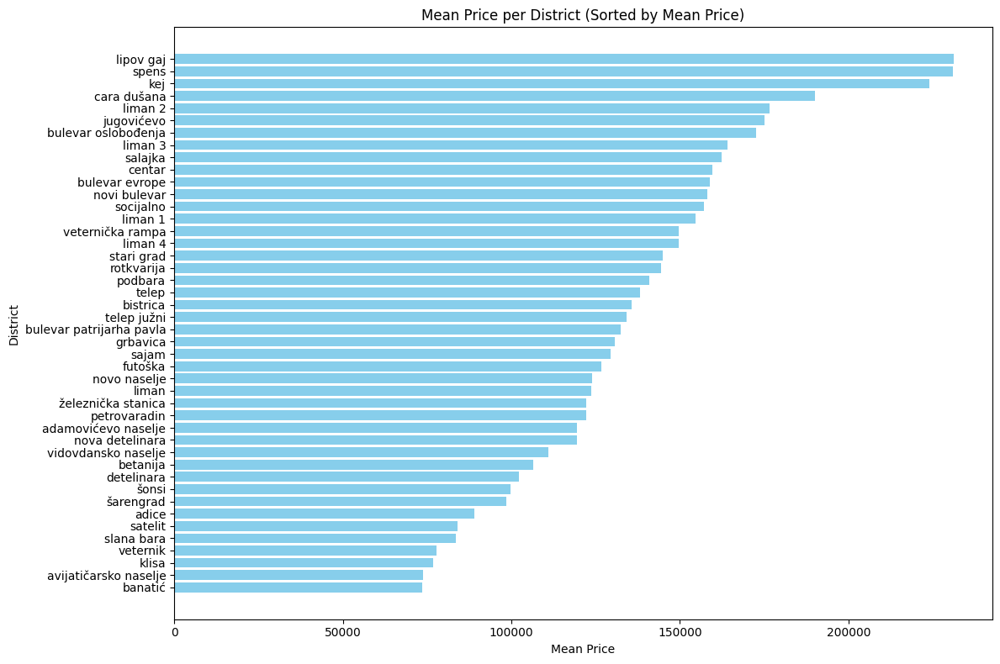

# Serbia Novi Sad Estate Evaluation (in development)
Real estate prices calculation analysis in Serbia, Novi Sad.

## Data discription

|               | Price, EUR | Number of rooms | Size (m²) | Price per m², EUR |
|---------------|------------|-----------------|-----------|-------------------|
| count         | 993.000    | 993.000         | 993.000   | 993.000           |
| mean          | 139931.326 | 2.419           | 60.693    | 2346.487          |
| std           | 79476.208  | 1.101           | 30.599    | 535.930           |
| min           | 25850.000  | 0.500           | 16.000    | 972.970           |
| 25%           | 89600.000  | 1.500           | 40.000    | 1952.630          |
| 50%           | 121200.000 | 2.500           | 55.000    | 2350.730          |
| 75%           | 168000.000 | 3.000           | 72.000    | 2641.940          |
| max           | 754490.000 | 5.000           | 274.000   | 4929.580          |

## By District

| District               | Count | Mean Price | Min Price | Max Price | Price Std |
|------------------------|-------|------------|-----------|-----------|-----------|
| adamovićevo naselje   | 4     | 119480.00  | 95270     | 141410    | 20376.60  |
| adice                  | 73    | 88988.07   | 25850     | 141850    | 27473.21  |
| avijatičarsko naselje  | 8     | 73900.00   | 67700     | 89000     | 8949.54   |
| banatić                | 2     | 73635.00   | 65900     | 81370     | 10938.94  |
| betanija               | 3     | 106483.33  | 97850     | 123600    | 14823.66  |
| bistrica               | 12    | 135725.83  | 74150     | 199820    | 49160.76  |
| bulevar evrope         | 16    | 158877.50  | 83430     | 288400    | 64682.85  |
| bulevar oslobođenja    | 39    | 172660.00  | 46350     | 350800    | 77128.86  |
| bulevar patrijarha pavla | 23  | 132541.30  | 74160     | 366000    | 63022.75  |
| cara dušana            | 5     | 189994.00  | 145000    | 257500    | 57926.01  |
| centar                 | 83    | 159544.46  | 46350     | 353500    | 79734.64  |
| detelinara             | 33    | 102236.67  | 54280     | 151000    | 25346.74  |
| futoška                | 1     | 126690.00  | 126690    | 126690    | NaN       |
| grbavica               | 73    | 130691.77  | 47600     | 304800    | 57518.14  |
| jugovićevo             | 2     | 175100.00  | 175100    | 175100    | 0.00      |
| kej                    | 2     | 224000.00  | 180200    | 267800    | 61942.55  |
| klisa                  | 3     | 76826.67   | 45080     | 123600    | 41360.59  |
| liman                  | 1     | 123600.00  | 123600    | 123600    | NaN       |
| liman 1                | 7     | 154564.29  | 124000    | 173450    | 16975.27  |
| liman 2                | 8     | 176552.50  | 86520     | 236900    | 51332.61  |
| liman 3                | 17    | 164144.12  | 87500     | 294600    | 67592.30  |
| liman 4                | 13    | 149596.92  | 96420     | 247200    | 37305.55  |
| lipov gaj              | 4     | 231112.50  | 46350     | 298500    | 123243.50 |
| nova detelinara        | 70    | 119342.29  | 61800     | 236900    | 44263.31  |
| novi bulevar           | 6     | 158166.67  | 87550     | 288400    | 92291.98  |
| novo naselje           | 82    | 123848.71  | 62000     | 313900    | 49815.70  |
| petrovaradin           | 77    | 122082.86  | 56700     | 219200    | 43238.03  |
| podbara                | 33    | 140956.67  | 54800     | 340950    | 59441.27  |
| rotkvarija             | 8     | 144453.12  | 75500     | 184000    | 37603.97  |
| sajam                  | 64    | 129331.25  | 54500     | 280000    | 46758.73  |
| salajka                | 13    | 162362.62  | 52000     | 286650    | 83640.77  |
| satelit                | 8     | 83956.25   | 78000     | 88900     | 3754.56   |
| slana bara             | 1     | 83430.00   | 83430     | 83430     | NaN       |
| socijalno              | 18    | 157093.89  | 72100     | 370800    | 76658.33  |
| spens                  | 9     | 230920.00  | 119500    | 339900    | 74314.21  |
| stari grad             | 6     | 144823.33  | 103000    | 229000    | 46830.37  |
| telep                  | 90    | 138203.24  | 61800     | 377400    | 58603.97  |
| telep južni            | 5     | 134080.00  | 91500     | 147300    | 23855.23  |
| veternik               | 9     | 77840.00   | 36450     | 153500    | 37232.91  |
| veternička rampa       | 9     | 149661.67  | 110500    | 203000    | 34608.21  |
| vidovdansko naselje    | 3     | 111066.67  | 83400     | 164800    | 46541.31  |
| šarengrad              | 4     | 98412.50   | 87550     | 110400    | 12576.52  |
| šonsi                  | 6     | 99800.00   | 64890     | 144200    | 32483.98  |
| železnička stanica     | 17    | 122234.12  | 77250     | 270000    | 53046.68  |

## Price per m² and Size (m²) distribution by numers of room

## Mean Price per District (Sorted by Mean Price)

## Project UI 

A link to UI of the project: [Home page of the project](http://54.234.56.161:8083/)

