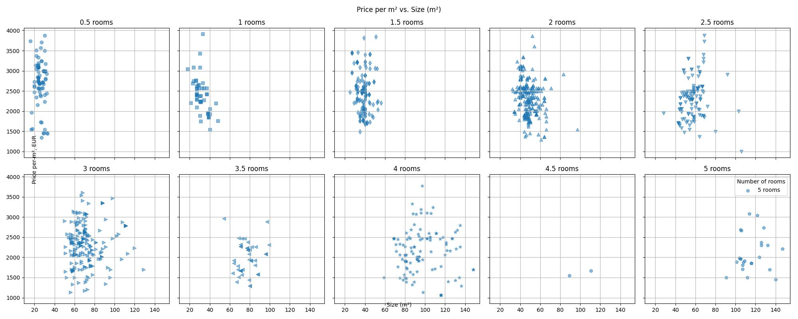

# SerbiaNoviSadEstateEvaluation (in development)
Real estate prices calculation analysis in Serbia, Novi Sad

## Data discription

|               | Price, EUR | Number of rooms | Size (m²) | Price per m², EUR |
|---------------|------------|-----------------|-----------|-------------------|
| count         | 993.000    | 993.000         | 993.000   | 993.000           |
| mean          | 139931.326 | 2.419           | 60.693    | 2346.487          |
| std           | 79476.208  | 1.101           | 30.599    | 535.930           |
| min           | 25850.000  | 0.500           | 16.000    | 972.970           |
| 25%           | 89600.000  | 1.500           | 40.000    | 1952.630          |
| 50%           | 121200.000 | 2.500           | 55.000    | 2350.730          |
| 75%           | 168000.000 | 3.000           | 72.000    | 2641.940          |
| max           | 754490.000 | 5.000           | 274.000   | 4929.580          |

## Price per m² and Size (m²) distribution by numers of room

